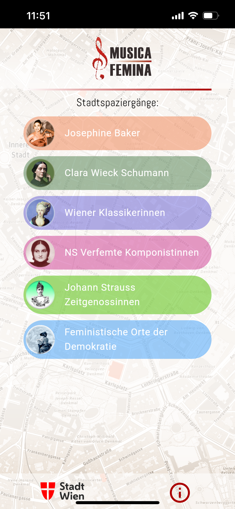
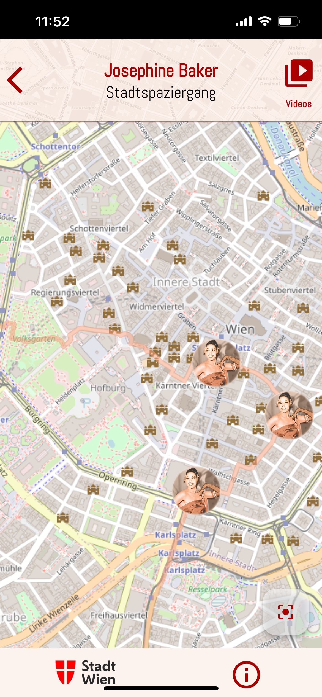
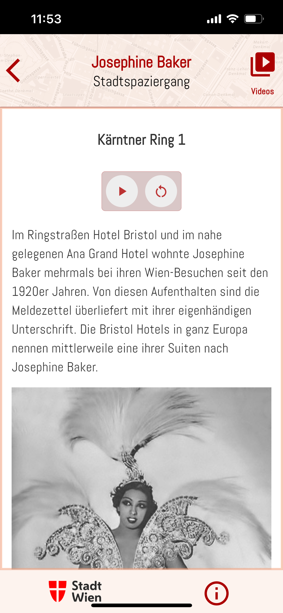
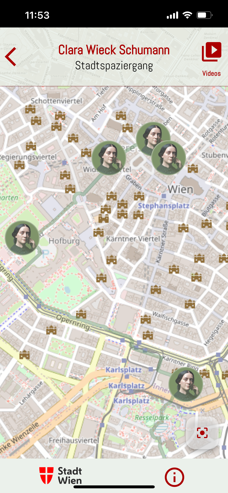

# MusicaFemina Stadtspaziergänge (Work in Progress) 🎶

**WebApp Demo Version**  
Created for the **Musica Femina Verein**  
Concept by **Irene Suchy**  
[Demo URL: l4ndl0s1.github.io](https://l4ndl0s1.github.io)

---

## About the Project

The **MusicaFemina Stadtspaziergänge App** is an interactive web application, built with **Flutter** and powered by **OpenStreetMap**, that invites users to explore Vienna’s rich and often overlooked history of women composers and musicians. It combines historical insights with modern technology, creating an innovative cultural and educational tool.

### Features
- **Follow Historical Figures**: Walk the paths of **Clara Schumann**, visit **Marianne Martinez** or **Maria Theresia Paradis**, and relive the scandals involving **Josephine Baker**.
- **Interactive Map Integration**:
  - Uses **OpenStreetMap** for precise and engaging historical city tours.
  - Allows users to visualize locations tied to Vienna’s women composers and musicians.
- **Comprehensive Resource**:
  - A **lexicon** of women composers' contributions in Vienna.
  - A **historical city tour** showcasing women’s role in Vienna’s music history.
- **Sustainability**: A meaningful contribution to Vienna’s city history and tourism with a focus on women’s contributions to the arts.

---

## Built With
- **Flutter**: For a smooth, cross-platform experience.
- **OpenStreetMap**: For detailed and interactive map-based navigation.

---

## Goals
- Provide an **accessible, educational resource** for exploring women’s music history in Vienna.
- Serve as a **sustainable and innovative addition** to Vienna’s cultural tourism.
- Highlight the **importance of women composers and musicians** in shaping Vienna’s cultural identity.

---

## Development Team
- **Programming & Design**: Laurus Edelbacher, Severin Gombocz

---

## Status
- This is a **work in progress** with a **demo version** currently available.

Explore the project: [l4ndl0s1.github.io](https://l4ndl0s1.github.io)  
---
## Screenshots

